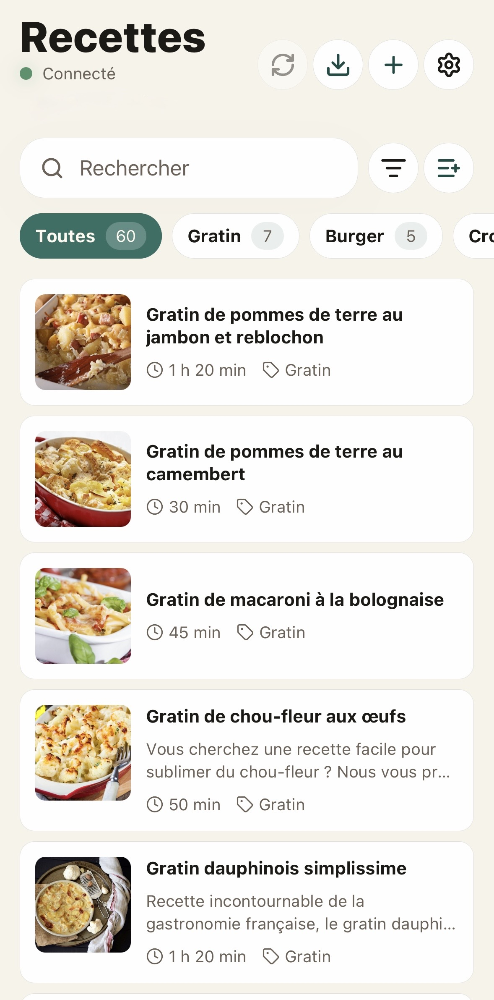
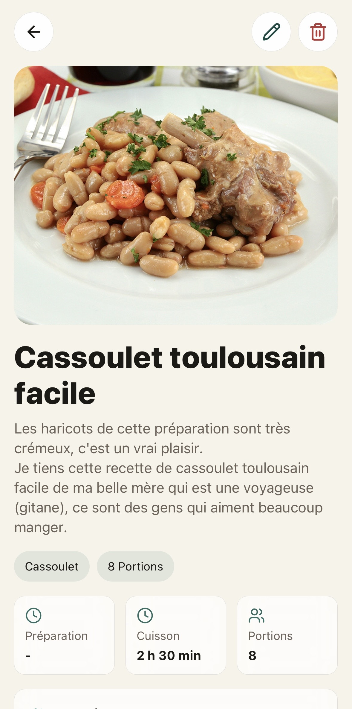

# AvoCook

[Français](#français) | [English](#english)

---

## Français

Application mobile iOS, iPadOS et Android pour consulter, importer, créer et modifier des recettes synchronisées avec l'application Nextcloud Cookbook.

[Télécharger sur l'App Store](https://apps.apple.com/app/avocook/id6769012665) | [Télécharger l'APK Android](https://github.com/Logarex/AvoCook/releases/latest)

<p align="center">
  
  
</p>

### Fonctionnalités

- Connexion directe à un serveur Nextcloud via app password.
- Mode local gratuit sans compte Nextcloud.
- Synchronisation avec l'API publique Nextcloud Cookbook `0.1.3`.
- Option pour conserver une copie locale des recettes et les consulter hors ligne.
- File de synchronisation pour créations, modifications et suppressions hors connexion.
- Import depuis une URL via l'endpoint Cookbook, puis fallback JSON-LD schema.org côté mobile.
- Import pensé pour les grands sites de recettes français et internationaux exposant schema.org Recipe, dont Marmiton, CuisineAZ, 750g, Chefkoch, BBC Good Food, Allrecipes, GialloZafferano et Cookpad.
- Photos de recettes récupérées depuis les sites importés ou ajoutées manuellement depuis la galerie.
- Ajout et modification manuels avec champs clairs.
- Thèmes clair/sombre/système et langues français/anglais.
- Interface adaptative avec surfaces glass sur iOS et rendu sobre sur Android.
- Option pour garder l'écran allumé pendant la consultation d'une recette.
- Minuteurs de recette avec notifications locales pour sonner quand le téléphone est verrouillé.

### Stack

- Expo React Native + TypeScript
- React Navigation
- Expo SecureStore pour les identifiants
- Expo SQLite pour le mode hors ligne
- Expo Blur/Image/ImagePicker/FileSystem/KeepAwake pour l'expérience mobile
- i18next pour l'internationalisation
- Vitest pour les tests unitaires purs

### Installation

```bash
npm install
npm run start
```

Puis lancer l'app dans Expo Go, un simulateur iOS, un émulateur Android ou un development build.

### Connexion Nextcloud

1. Installer et activer l'application Cookbook sur le serveur Nextcloud.
2. Créer un mot de passe d'application dans Nextcloud.
3. Se connecter dans l'app avec l'URL du serveur, l'identifiant et l'app password.

L'app refuse les URL HTTP sauf `localhost` pendant le développement.

La validation de connexion utilise `/ocs/v2.php/cloud/user?format=json` avec l'en-tête `OCS-APIRequest: true`, ce qui force Nextcloud à vérifier réellement l'identifiant et l'app password. L'appel aux capacités sert ensuite à détecter l'environnement serveur.

### Mode local

Le bouton `Utiliser sans Nextcloud` permet d'utiliser l'app gratuitement sans compte ni serveur. Les recettes et photos restent dans le stockage de l'application sur l'appareil.

### Dossier Cookbook

Dans les réglages, le champ `Dossier Cookbook` modifie la configuration utilisateur de Cookbook via l'API `/apps/cookbook/api/v1/config`. Le dossier est normalisé avec un `/` initial.

### Publication

La configuration `eas.json` prépare trois profils :

- `development` pour les builds internes avec dev client.
- `preview` pour TestFlight ou distribution Android interne.
- `production` pour App Store Connect et Google Play.

Avant publication, remplacer les assets dans `assets/`, créer le projet EAS, puis mettre à jour `extra.eas.projectId` dans `app.json`.

```bash
npx eas init
npx eas build --platform ios --profile production
npx eas build --platform android --profile production
```

Pour générer un fichier `.apk` distribuable sur GitHub :
```bash
npx eas build --platform android --profile preview
```

### Tests

```bash
npm run typecheck
npm test
npm run import:check -- https://www.marmiton.org/recettes/recette_gateau-leger-au-chocolat_15680.aspx
```

### Notes sur l'import de recettes

Nextcloud Cookbook importe déjà les pages contenant des métadonnées schema.org Recipe. L'app utilise ce mécanisme en priorité pour que la recette arrive directement dans le serveur de l'utilisateur. Si le serveur ne peut pas importer la page, l'app tente une extraction JSON-LD locale puis crée la recette dans Cookbook.

Les sites qui changent souvent leur HTML doivent être ajoutés sous forme d'adapters dédiés dans `src/features/import/` plutôt que via du scraping fragile.

Le script `npm run import:check -- <url>` vérifie rapidement qu'une page expose un objet `Recipe`, des ingrédients, des étapes et une image.

### Licence
Ce projet est sous licence MIT.

---

## English

iOS, iPadOS, and Android mobile application to view, import, create, and edit recipes synchronized with the Nextcloud Cookbook app.

[Download on the App Store](https://apps.apple.com/app/avocook/id6769012665) | [Download Android APK](https://github.com/Logarex/AvoCook/releases/latest)

<p align="center">
  
  
</p>

### Features

- Direct connection to a Nextcloud server via app password.
- Free local mode without a Nextcloud account.
- Synchronization with Nextcloud Cookbook public API `0.1.3`.
- Option to keep a local copy of recipes and view them offline.
- Sync queue for offline creations, modifications, and deletions.
- Import from URL via Cookbook endpoint, then fallback to JSON-LD schema.org on the mobile side.
- Import designed for major French and international recipe sites exposing schema.org Recipe, including Marmiton, CuisineAZ, 750g, Chefkoch, BBC Good Food, Allrecipes, GialloZafferano, and Cookpad.
- Recipe photos retrieved from imported sites or added manually from the gallery.
- Manual addition and modification with clear fields.
- Light/dark/system themes and French/English languages.
- Adaptive interface with glass surfaces on iOS and a sober design on Android.
- Option to keep the screen on while viewing a recipe.
- Recipe timers with local notifications to ring when the phone is locked.

### Stack

- Expo React Native + TypeScript
- React Navigation
- Expo SecureStore for credentials
- Expo SQLite for offline mode
- Expo Blur/Image/ImagePicker/FileSystem/KeepAwake for mobile experience
- i18next for internationalization
- Vitest for pure unit tests

### Installation

```bash
npm install
npm run start
```

Then launch the app in Expo Go, an iOS simulator, an Android emulator, or a development build.

### Nextcloud Connection

1. Install and enable the Cookbook app on the Nextcloud server.
2. Create an app password in Nextcloud.
3. Log in to the app with the server URL, username, and app password.

The app refuses HTTP URLs except `localhost` during development.

Connection validation uses `/ocs/v2.php/cloud/user?format=json` with the `OCS-APIRequest: true` header, which forces Nextcloud to actually check the username and app password. The capabilities call is then used to detect the server environment.

### Local Mode

The `Use without Nextcloud` button allows you to use the app for free without an account or server. Recipes and photos remain in the app's storage on the device.

### Cookbook Folder

In settings, the `Cookbook Folder` field modifies the user configuration of Cookbook via the API `/apps/cookbook/api/v1/config`. The folder is normalized with a leading `/`.

### Publication

The `eas.json` configuration prepares three profiles:

- `development` for internal builds with dev client.
- `preview` for TestFlight or internal Android distribution.
- `production` for App Store Connect and Google Play.

Before publishing, replace assets in `assets/`, create the EAS project, then update `extra.eas.projectId` in `app.json`.

```bash
npx eas init
npx eas build --platform ios --profile production
npx eas build --platform android --profile production
```

To generate a distributable `.apk` file on GitHub:
```bash
npx eas build --platform android --profile preview
```

### Tests

```bash
npm run typecheck
npm test
npm run import:check -- https://www.marmiton.org/recettes/recette_gateau-leger-au-chocolat_15680.aspx
```

### Notes on Recipe Import

Nextcloud Cookbook already imports pages containing schema.org Recipe metadata. The app uses this mechanism as a priority so that the recipe arrives directly in the user's server. If the server cannot import the page, the app attempts local JSON-LD extraction and then creates the recipe in Cookbook.

Sites that often change their HTML should be added as dedicated adapters in `src/features/import/` rather than via fragile scraping.

The `npm run import:check -- <url>` script quickly checks that a page exposes a `Recipe` object, ingredients, steps, and an image.

### License
This project is licensed under the MIT License.
