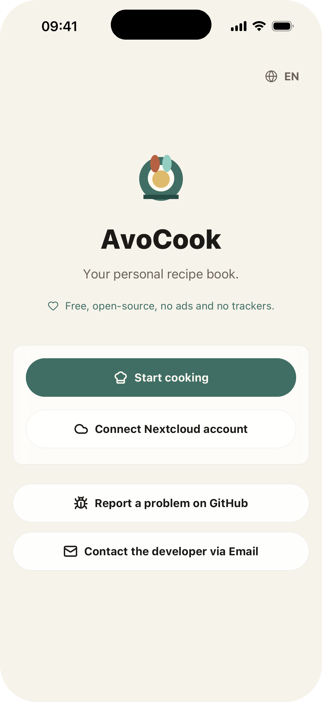
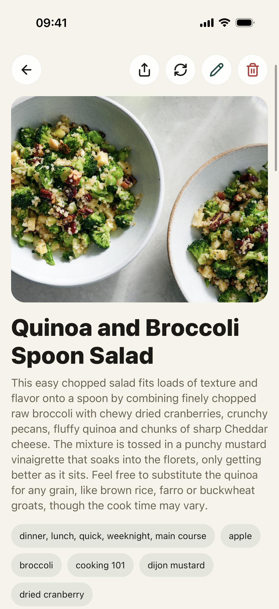

# AvoCook

AvoCook is a mobile recipe notebook — it works entirely offline, on your device, with no account needed. If you already run a Nextcloud server, you can optionally connect it to keep everything in sync.

I built it for personal use while learning to ship a complete React Native project from start to finish.

[App Store](https://apps.apple.com/app/avocook/id6769012665) ·
[Google Play](https://play.google.com/store/apps/details?id=app.avocook.mobile) · [Android APK](https://github.com/Logarex/AvoCook/releases/latest) ·
[](https://github.com/Logarex/AvoCook/releases)

<div align="center">
  
  
</div>

---

## What's new in v4.0.0

**Community Recipe Platform**
- **Share, Rate & Import:** A massive new space to discover, rate, report, and import recipes directly from the AvoCook community.
- **Community Profiles:** Set up a community pseudonym (with persistent storage) to share your best meals.
- **Rich Metadata:** Community recipes fully support nutritional information and prep timing metadata.
- **Moderation & Quality:** A global built-in profanity filter keeps the platform safe, while a new duplicate detection system prevents spam for both local imports and community submissions. 

**Real-Time Shared Shopping Lists**
- **6-Digit Code Collaboration:** It is now possible to share and collaborate on grocery lists with other people using a simple 6-digit code.
- **Sync Indicator:** Added an active synchronization status indicator to the Shopping List screen so everyone knows when the list is updating.

**UI Polish & Enhancements**
- **Quick Category Picker:** Added a new button to trigger the category picker directly within the Recipe List screen.
- **Better Modals:** The "Select Recipe to Share" modal now sorts recipes alphabetically and prevents awkward font scaling on different devices.
- **Settings & Typography:** Enabled multi-line labels for buttons in settings and improved the overall typography and spacing across search and community screens. 
- **Character Normalization:** Special characters in recipe lists are now normalized for better searching and sorting.

**Localization & Under the hood**
- **Danish Language:** Full Danish localization support has been added! Recipe imports will now better preserve their original language.
- **Translation Engine:** Migrated remaining hardcoded strings to i18n keys for absolute translation support across all screens (including new error keys).
- **Performance:** Heavily optimized asynchronous state handling across all screens and removed obsolete asset scripts for a snappier experience. Removed deprecated Play Integrity requirements.

---

## Features

### Recipes

- Create and edit recipes locally, no account required;
- Organise recipes by category;
- Adjust ingredient quantities to the number of servings;
- Add one or more photos per recipe;
- Export a recipe as PDF or print it directly;
- Share a recipe with another app (share sheet).

### Import

- Import a recipe from a URL — works on any site that exposes `schema.org/Recipe` data (Marmiton, 750g, BBC Good Food, and many others);
- Receive a URL shared from a browser or another app to import a recipe in one tap;
- Scan a recipe from a photo, or generate a recipe from a picture of a dish using AI (requires an OpenAI-compatible API key).

### Shopping list

- Copy ingredients to the clipboard with a tap;
- Export a shopping list to iOS Reminders to take advantage of Apple's sharing and Siri integration.

### Timers

- Start one or several cooking timers directly from a recipe;
- Timers trigger a local notification even when the app is in the background.

### Data & sync

- Back up all recipes to a JSON file and restore them;
- **Optional**: connect a Nextcloud Cookbook server to sync recipes across devices. All data goes directly between the app and your server — nothing passes through a third-party service.

> In local mode, everything stays on your device. No account, no cloud, no tracking.

---

## Available languages

French · English · German · Spanish · Italian

---

## Development setup

The project uses Expo, React Native and TypeScript.

```bash
npm install
npm run ios      # iOS simulator
npm run android  # Android emulator
```

A development build with native modules is compiled on the first run. After that, the app opens directly.

Useful commands:

```bash
npm run typecheck          # TypeScript checks
npm test                   # Unit tests (Vitest)
npm run lint               # ESLint
npm run import:check -- <recipe-url>  # Test a recipe import from a URL
```

---

## Project structure

```
src/
├── App.tsx                        # Entry point, navigation setup
├── screens/                       # Application screens (list, detail, editor, settings…)
├── components/                    # Reusable UI components
├── features/
│   ├── recipes/                   # Local storage (SQLite), recipe logic, backup/restore
│   ├── nextcloud/                 # HTTP client for Nextcloud Cookbook
│   ├── import/                    # URL and photo recipe import
│   ├── shopping/                  # Shopping list and iOS Reminders sync
│   ├── timers/                    # Cooking timers
│   ├── preferences/               # App settings
│   └── auth/                      # Nextcloud authentication
├── i18n/                          # Internationalisation (i18next, 5 languages)
├── modules/
│   └── avocook-timer-notifications/  # Native module for timer notifications
└── theme/                         # Colors, typography, shared styles
tools/                             # Build plugins, import checker, asset generator
docs/                              # Documentation in other languages (fr, de, es, it)
```

---

## Nextcloud Cookbook

To test the sync:

1. Install the [Cookbook app](https://apps.nextcloud.com/apps/cookbook) on a Nextcloud instance.
2. Create an **app password** in the security settings (Settings → Security → Devices & sessions).
3. In AvoCook, go to Settings and enter your server URL, username, and that password.

The app enforces HTTPS for remote servers. Plain HTTP is accepted only for `localhost` during development.

---

## Android

APKs are published in the [GitHub releases](https://github.com/Logarex/AvoCook/releases). Download `avocook.apk` and install it directly.

---

## Contributing

Pull requests are welcome. See [CONTRIBUTING.md](.github/CONTRIBUTING.md) for the guidelines and the PR template.

---

## Support the project ☕

If you find AvoCook useful, you can help cover the costs:

**[→ Donate via Revolut](https://revolut.me/logarex)** · **[→ Donate via PayPal](https://paypal.me/logarex31)**

---

## Licence

This project is licenced under the [GPLv3](LICENSE) licence.
