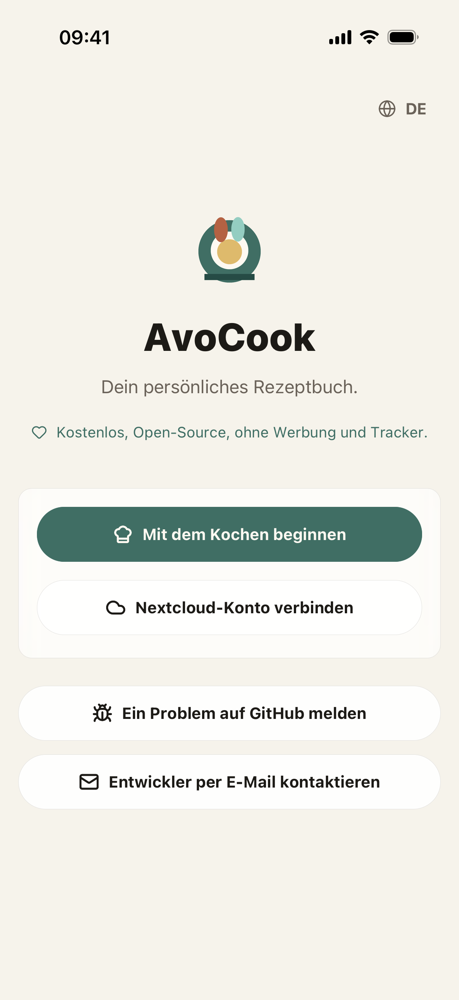
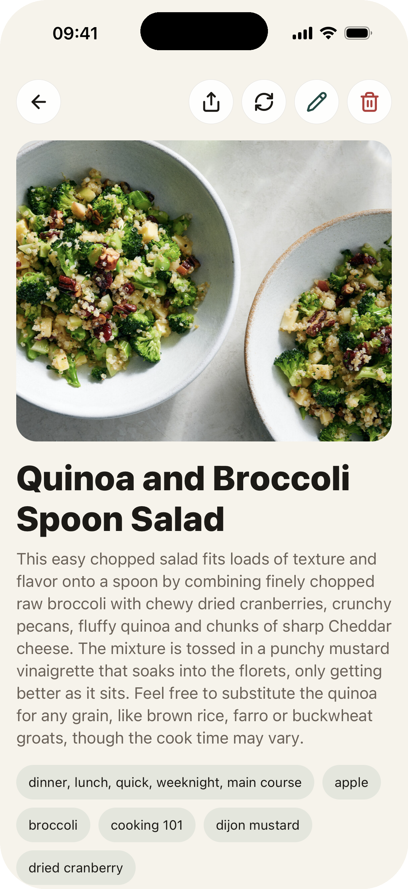

# AvoCook

AvoCook ist ein mobiles Rezeptheft — es funktioniert vollständig offline, auf deinem Gerät, ohne Konto. Wenn du bereits einen Nextcloud-Server betreibst, kannst du ihn optional verbinden, um deine Rezepte geräteübergreifend zu synchronisieren.

Ich habe es für den persönlichen Gebrauch entwickelt und dabei gelernt, ein vollständiges React Native-Projekt von Anfang bis Ende umzusetzen.

[App Store](https://apps.apple.com/app/avocook/id6769012665) · [Google Play](https://play.google.com/store/apps/details?id=app.avocook.mobile) · [Android APK](https://github.com/Logarex/AvoCook/releases/latest) · [](https://github.com/Logarex/AvoCook/releases)

<div align="center">
  
  
</div>

---

## Funktionen

### Community-Plattform

- Entdecke, bewerte und importiere Rezepte aus der AvoCook-Community;
- Übersetze Community-Rezepte direkt in der App;
- Teile deine besten Gerichte, indem du ein Community-Profil erstellst;
- Sichere und moderierte Plattform mit integrierter Spam-Erkennung.

### Rezepte

- Rezepte lokal erstellen und bearbeiten, ohne Konto;
- Rezepte nach Kategorie organisieren;
- Zutatenmengen nach Portionenanzahl anpassen;
- Ein oder mehrere Fotos pro Rezept hinzufügen;
- Ein Rezept als PDF exportieren oder direkt drucken;
- Ein Rezept über die Teilen-Funktion weitergeben.

### Import

- Ein Rezept von einer URL importieren — funktioniert auf allen Seiten, die `schema.org/Recipe`-Daten bereitstellen (Marmiton, 750g, BBC Good Food und viele andere);
- Eine aus einem Browser oder einer anderen App geteilte URL empfangen, um Rezepte mit einem Tippen zu importieren;
- Ein Rezept aus einem Foto scannen oder mithilfe von KI ein Rezept aus einem Gerichtsfoto generieren (erfordert einen OpenAI-kompatiblen API-Schlüssel).

### Einkaufsliste

- Arbeite in Echtzeit an Einkaufslisten mit einem 6-stelligen Code zusammen, inkl. Push-Benachrichtigungen und Teilnehmeranzeige;
- Zutaten mit einem Tippen in die Zwischenablage kopieren;
- Eine Einkaufsliste in iOS-Erinnerungen exportieren, um Apples Teilen-Funktion und Siri-Integration zu nutzen.

### Timer

- Einen oder mehrere Koch-Timer direkt aus einem Rezept starten;
- Timer lösen eine lokale Benachrichtigung aus, auch wenn die App im Hintergrund läuft.

### Daten & Synchronisierung

- Alle Rezepte in einer JSON-Datei sichern und wiederherstellen;
- **Optional**: einen Nextcloud Cookbook-Server verbinden, um Rezepte geräteübergreifend zu synchronisieren. Die Daten fließen direkt zwischen der App und deinem Server — kein Drittanbieter ist beteiligt.

> Im lokalen Modus bleibt alles auf deinem Gerät. Kein Konto, keine Cloud, kein Tracking.

---

## Verfügbare Sprachen

Französisch · Englisch · Deutsch · Spanisch · Italienisch · Dänisch

---

## Entwicklungs-Setup

Das Projekt verwendet Expo, React Native und TypeScript.

```bash
npm install
npm run ios      # iOS-Simulator
npm run android  # Android-Emulator
```

Beim ersten Start wird ein Entwicklungs-Build mit nativen Modulen kompiliert. Danach öffnet sich die App direkt.

Nützliche Befehle:

```bash
npm run typecheck                        # TypeScript-Prüfungen
npm test                                 # Unit-Tests (Vitest)
npm run lint                             # ESLint
npm run import:check -- <rezept-url>     # Einen Rezept-Import von einer URL testen
```

---

## Projektstruktur

```
src/
├── App.tsx                              # Einstiegspunkt, Navigation
├── screens/                             # Screens (Liste, Detail, Editor, Einstellungen…)
├── components/                          # Wiederverwendbare UI-Komponenten
├── features/
│   ├── recipes/                         # Lokaler Speicher (SQLite), Rezeptlogik, Backup
│   ├── nextcloud/                       # HTTP-Client für Nextcloud Cookbook
│   ├── import/                          # Import per URL und Foto
│   ├── shopping/                        # Einkaufsliste und iOS-Erinnerungen-Sync
│   ├── timers/                          # Koch-Timer
│   ├── preferences/                     # App-Einstellungen
│   └── auth/                            # Nextcloud-Authentifizierung
├── i18n/                                # Internationalisierung (i18next, 5 Sprachen)
├── modules/
│   └── avocook-timer-notifications/     # Natives Modul für Timer-Benachrichtigungen
└── theme/                               # Farben, Typografie, geteilte Styles
tools/                                   # Build-Plugins, Import-Checker, Asset-Generator
docs/                                    # Dokumentation in anderen Sprachen (fr, de, es, it)
```

---

## Nextcloud Cookbook

So testest du die Synchronisierung:

1. Installiere die [Cookbook-App](https://apps.nextcloud.com/apps/cookbook) auf einer Nextcloud-Instanz.
2. Erstelle in den Sicherheitseinstellungen ein **App-Passwort** (Einstellungen → Sicherheit → Geräte und Sitzungen).
3. Gib in AvoCook (Einstellungen) die Server-URL, den Benutzernamen und das App-Passwort ein.

Die App erzwingt HTTPS für entfernte Server. Einfaches HTTP wird nur für `localhost` während der Entwicklung akzeptiert.

---

## Android

APKs werden in den [GitHub-Releases](https://github.com/Logarex/AvoCook/releases) veröffentlicht. Lade `avocook.apk` herunter und installiere es direkt.

---

## Mitmachen

Pull Requests sind willkommen. Siehe [CONTRIBUTING.md](../../.github/CONTRIBUTING.md) für die Richtlinien und die PR-Vorlage.

---

## Das Projekt unterstützen ☕

Wenn dir AvoCook nützlich ist, kannst du helfen, die Kosten zu decken:

**[→ Spenden via Revolut](https://revolut.me/logarex)** · **[→ Spenden via PayPal](https://paypal.me/logarex31)**

---

## Lizenz

Dieses Projekt ist unter der [GPLv3](../../LICENSE)-Lizenz lizenziert.
