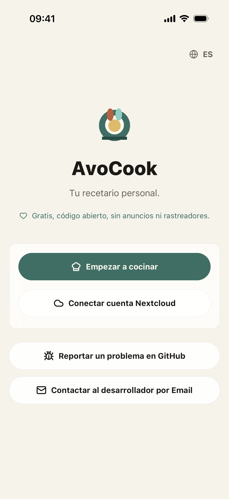

# AvoCook

AvoCook es un cuaderno de recetas móvil — funciona completamente sin conexión, en tu dispositivo, sin necesidad de cuenta. Si ya tienes un servidor Nextcloud, puedes conectarlo de forma opcional para sincronizar tus recetas entre dispositivos.

Lo desarrollé para uso personal mientras aprendía a llevar un proyecto React Native completo de principio a fin.

[App Store](https://apps.apple.com/app/avocook/id6769012665) · [APK Android](https://github.com/Logarex/AvoCook/releases/latest) · [](https://github.com/Logarex/AvoCook/releases)

<div align="center">
  
  
</div>

---

## Funcionalidades

### Recetas

- Crear y editar recetas localmente, sin cuenta;
- Organizar recetas por categoría;
- Ajustar las cantidades según el número de raciones;
- Añadir una o varias fotos a cada receta;
- Exportar una receta en PDF o imprimirla directamente;
- Compartir una receta con otra aplicación.

### Importación

- Importar una receta desde una URL — funciona en cualquier sitio que exponga datos `schema.org/Recipe` (Marmiton, 750g, BBC Good Food y muchos más);
- Recibir una URL compartida desde un navegador u otra app para importar una receta con un toque;
- Escanear una receta desde una foto, o generar una receta a partir de la foto de un plato con IA (requiere una clave API compatible con OpenAI).

### Lista de la compra

- Copiar los ingredientes al portapapeles con un toque;
- Exportar una lista de la compra a Recordatorios de iOS para aprovechar el sistema de compartir de Apple y la integración con Siri.

### Temporizadores

- Iniciar uno o varios temporizadores de cocina directamente desde una receta;
- Los temporizadores lanzan una notificación local incluso cuando la app está en segundo plano.

### Datos y sincronización

- Hacer una copia de seguridad de todas las recetas en un archivo JSON y restaurarlas;
- **Opcional**: conectar un servidor Nextcloud Cookbook para sincronizar recetas entre dispositivos. Los datos van directamente entre la app y tu servidor, sin pasar por ningún servicio de terceros.

> En modo local, todo se queda en tu dispositivo. Sin cuenta, sin nube, sin rastreo.

---

## Idiomas disponibles

Francés · Inglés · Alemán · Español · Italiano

---

## Configuración de desarrollo

El proyecto utiliza Expo, React Native y TypeScript.

```bash
npm install
npm run ios      # Simulador iOS
npm run android  # Emulador Android
```

En el primer inicio se compila una build de desarrollo con módulos nativos. Después, la app se abre directamente.

Comandos útiles:

```bash
npm run typecheck                      # Verificaciones TypeScript
npm test                               # Tests unitarios (Vitest)
npm run lint                           # ESLint
npm run import:check -- <url-receta>   # Probar la importación desde una URL
```

---

## Estructura del proyecto

```
src/
├── App.tsx                              # Punto de entrada, navegación
├── screens/                             # Pantallas (lista, detalle, editor, ajustes…)
├── components/                          # Componentes de UI reutilizables
├── features/
│   ├── recipes/                         # Almacenamiento local (SQLite), lógica recetas, backup
│   ├── nextcloud/                       # Cliente HTTP para Nextcloud Cookbook
│   ├── import/                          # Importación por URL y foto
│   ├── shopping/                        # Lista de la compra y sync con Recordatorios iOS
│   ├── timers/                          # Temporizadores de cocina
│   ├── preferences/                     # Configuración de la aplicación
│   └── auth/                            # Autenticación Nextcloud
├── i18n/                                # Internacionalización (i18next, 5 idiomas)
├── modules/
│   └── avocook-timer-notifications/     # Módulo nativo para notificaciones de temporizador
└── theme/                               # Colores, tipografía, estilos compartidos
tools/                                   # Plugins de build, verificador de importación, assets
docs/                                    # Documentación en otros idiomas (fr, de, es, it)
```

---

## Nextcloud Cookbook

Para probar la sincronización:

1. Instala la [aplicación Cookbook](https://apps.nextcloud.com/apps/cookbook) en una instancia de Nextcloud.
2. Crea una **contraseña de aplicación** en la configuración de seguridad (Ajustes → Seguridad → Dispositivos y sesiones).
3. En AvoCook (Ajustes), introduce la URL del servidor, el nombre de usuario y esa contraseña.

La app exige HTTPS para servidores remotos. El HTTP simple solo se acepta para `localhost` durante el desarrollo.

---

## Android

Los APK se publican en las [releases de GitHub](https://github.com/Logarex/AvoCook/releases). Descarga `avocook.apk` e instálalo directamente.

---

## Contribuir

Las pull requests son bienvenidas. Consulta [CONTRIBUTING.md](../../.github/CONTRIBUTING.md) para las pautas y la plantilla de PR.

---

## Apoyar el proyecto ☕

Si AvoCook te resulta útil, puedes ayudar a cubrir los costes:

**[→ Donar vía Revolut](https://revolut.me/logarex)** · **[→ Donar vía PayPal](https://paypal.me/logarex31)**

---

## Licencia

Este proyecto está bajo la licencia [GPLv3](../../LICENSE).
