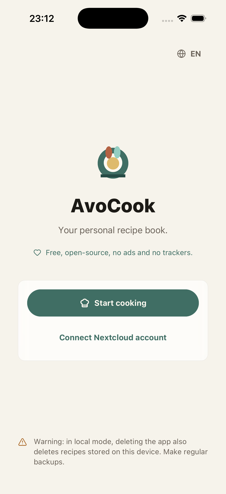
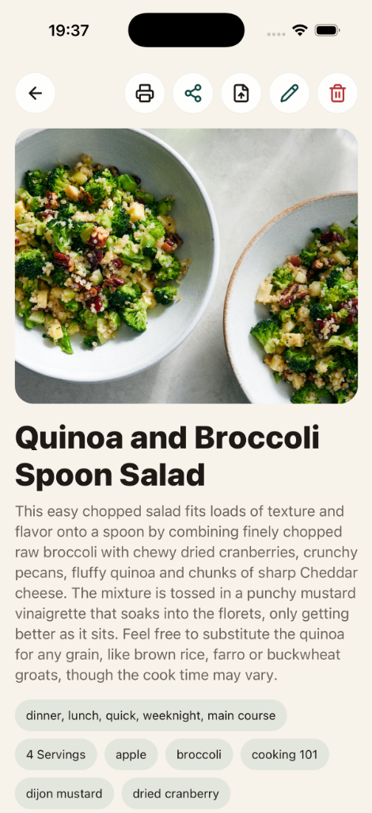

# AvoCook

AvoCook est une application mobile de recettes que je développe pour mon usage personnel et pour apprendre à créer un projet React Native complet de bout en bout.

L'idée est simple : gardez vos recettes au même endroit, utilisez-les hors ligne et synchronisez-les avec Nextcloud Cookbook si vous disposez déjà d'un serveur.

[App Store](https://apps.apple.com/app/avocook/id6769012665) · [APK Android](https://github.com/Logarex/AvoCook/releases/latest) · [](https://github.com/Logarex/AvoCook/releases)

<p align="center">
  
  
</p>

## Ce que l'application peut faire

- créer et modifier des recettes localement ;
- organiser les recettes par catégorie ;
- ajouter des photos ;
- scanner des recettes à partir de photos ou générer des recettes à partir de photos de plats grâce à l'IA (nécessite une clé API) ;
- importer une recette depuis une URL lorsque le site expose des données `schema.org/Recipe` ;
- recevoir des URL partagées depuis d'autres applications (comme les navigateurs web) pour importer rapidement des recettes ;
- ajuster les quantités en fonction du nombre de portions ;
- copier les ingrédients dans le presse-papiers ;
- lancer des minuteurs de cuisson ;
- exporter une recette en PDF ou l'imprimer ;
- sauvegarder / restaurer des recettes vers un fichier JSON ;
- synchroniser avec Nextcloud Cookbook, si l'utilisateur le souhaite ;
- synchroniser avec l'application Rappels d'iOS pour tirer parti des fonctionnalités de partage d'Apple.

Le mode local ne nécessite aucun compte. Les données restent sur l'appareil.

## Configuration pour le développement

Le projet utilise Expo, React Native et TypeScript.

```bash
npm install
npm run start
```

Ensuite, ouvrez l'application avec Expo Go ou un build de développement.

Commandes utiles :

```bash
npm run typecheck
npm test
npm run lint
npm run import:check -- <url-recette>
```

## Nextcloud Cookbook

Pour tester la synchronisation :

1. Installez l'application Cookbook sur une instance Nextcloud.
2. Créez un mot de passe d'application dans les paramètres de sécurité.
3. Entrez l'URL du serveur, le nom d'utilisateur et ce mot de passe dans AvoCook.

L'application rejette les serveurs distants via HTTP. Le HTTP est accepté pour `localhost` lors du développement.

## Android

Les APK sont publiés dans les versions GitHub (releases). Le fichier principal à installer est `avocook.apk`.

## Structure du projet

- `src/screens` : écrans de l'application ;
- `src/components` : composants réutilisables ;
- `src/features/recipes` : stockage local, synchronisation et logique des recettes ;
- `src/features/nextcloud` : client HTTP pour Cookbook ;
- `src/features/import` : importation de recettes depuis des pages web ;
- `src/modules/avocook-timer-notifications` : petit module natif pour les notifications du minuteur.

## Soutenir le projet ☕

Si vous appréciez AvoCook et souhaitez m'aider à financer les frais, vous pouvez faire un don :

- [Faire un don via Revolut](https://revolut.me/logarex)
- [Faire un don via PayPal](https://paypal.me/logarex31)

## Licence

Ce projet est sous licence [GPLv3](../../LICENSE).
