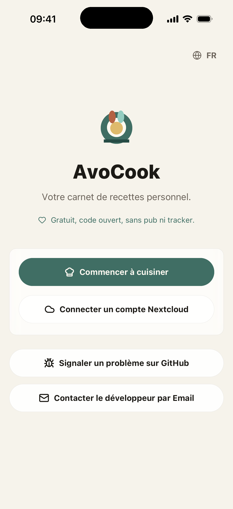
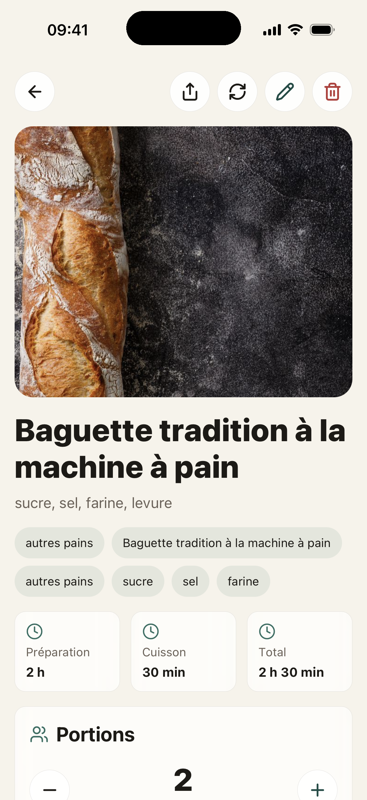

# AvoCook

AvoCook est un carnet de recettes mobile — il fonctionne entièrement hors ligne, sur votre appareil, sans compte. Si vous avez déjà un serveur Nextcloud, vous pouvez le connecter pour garder vos recettes synchronisées entre vos appareils.

Je l'ai développé pour mon usage personnel en apprenant à mener un projet React Native complet de bout en bout.

[App Store](https://apps.apple.com/app/avocook/id6769012665) · [Google Play](https://play.google.com/store/apps/details?id=app.avocook.mobile) · [APK Android](https://github.com/Logarex/AvoCook/releases/latest) · [](https://github.com/Logarex/AvoCook/releases)

<div align="center">
  
  
</div>

---

## Fonctionnalités

### Plateforme Communautaire

- Découvrez, notez et importez des recettes de la communauté AvoCook ;
- Partagez vos meilleurs plats en créant un profil communautaire ;
- Plateforme modérée et sécurisée avec détection de spam intégrée.

### Recettes

- Créer et modifier des recettes localement, sans compte ;
- Organiser les recettes par catégorie ;
- Ajuster les quantités selon le nombre de portions ;
- Ajouter une ou plusieurs photos à chaque recette ;
- Exporter une recette en PDF ou l'imprimer directement ;
- Partager une recette vers une autre application.

### Import

- Importer une recette depuis une URL — fonctionne sur tous les sites qui exposent des données `schema.org/Recipe` (Marmiton, 750g, BBC Good Food et beaucoup d'autres) ;
- Recevoir une URL partagée depuis un navigateur ou une autre app pour importer une recette en un geste ;
- Scanner une recette depuis une photo, ou générer une recette à partir d'une photo d'un plat grâce à l'IA (nécessite une clé API compatible OpenAI).

### Liste de courses

- Collaborez sur vos listes de courses en temps réel à l'aide d'un code à 6 chiffres ;
- Copier les ingrédients dans le presse-papiers en un geste ;
- Exporter une liste de courses vers les Rappels iOS pour profiter du partage Apple et de l'intégration Siri.

### Minuteurs

- Lancer un ou plusieurs minuteurs de cuisson directement depuis une recette ;
- Les minuteurs déclenchent une notification locale même quand l'app est en arrière-plan.

### Données et synchronisation

- Sauvegarder toutes les recettes dans un fichier JSON et les restaurer ;
- **Optionnel** : connecter un serveur Nextcloud Cookbook pour synchroniser les recettes entre appareils. Les données circulent directement entre l'app et votre serveur, sans passer par un service tiers.

> En mode local, tout reste sur l'appareil. Pas de compte, pas de cloud, pas de tracking.

---

## Langues disponibles

Français · Anglais · Allemand · Espagnol · Italien

---

## Configuration pour le développement

Le projet utilise Expo, React Native et TypeScript.

```bash
npm install
npm run ios      # Simulateur iOS
npm run android  # Émulateur Android
```

Un build de développement avec les modules natifs est compilé au premier lancement. Ensuite, l'application s'ouvre directement.

Commandes utiles :

```bash
npm run typecheck                       # Vérifications TypeScript
npm test                                # Tests unitaires (Vitest)
npm run lint                            # ESLint
npm run import:check -- <url-recette>   # Tester l'import depuis une URL
```

---

## Structure du projet

```
src/
├── App.tsx                              # Point d'entrée, navigation
├── screens/                             # Écrans (liste, détail, éditeur, paramètres…)
├── components/                          # Composants UI réutilisables
├── features/
│   ├── recipes/                         # Stockage local (SQLite), logique recettes, backup
│   ├── nextcloud/                       # Client HTTP pour Nextcloud Cookbook
│   ├── import/                          # Import depuis URL et photo
│   ├── shopping/                        # Liste de courses et synchronisation Rappels iOS
│   ├── timers/                          # Minuteurs de cuisson
│   ├── preferences/                     # Paramètres de l'application
│   └── auth/                            # Authentification Nextcloud
├── i18n/                                # Internationalisation (i18next, 5 langues)
├── modules/
│   └── avocook-timer-notifications/     # Module natif pour les notifications minuteur
└── theme/                               # Couleurs, typographie, styles partagés
tools/                                   # Plugins de build, vérificateur d'import, assets
docs/                                    # Documentation dans d'autres langues (fr, de, es, it)
```

---

## Nextcloud Cookbook

Pour tester la synchronisation :

1. Installez l'[application Cookbook](https://apps.nextcloud.com/apps/cookbook) sur une instance Nextcloud.
2. Créez un **mot de passe d'application** dans les paramètres de sécurité (Paramètres → Sécurité → Appareils et sessions).
3. Dans AvoCook, allez dans les paramètres et entrez l'URL du serveur, le nom d'utilisateur et ce mot de passe.

L'application impose HTTPS pour les serveurs distants. Le HTTP simple est accepté uniquement pour `localhost` en développement.

---

## Android

Les APK sont publiés dans les [releases GitHub](https://github.com/Logarex/AvoCook/releases). Téléchargez `avocook.apk` et installez-le directement.

---

## Contribuer

Les pull requests sont les bienvenues. Consultez [CONTRIBUTING.md](../../.github/CONTRIBUTING.md) pour les conventions et le modèle de PR.

---

## Soutenir le projet ☕

Si AvoCook vous est utile, vous pouvez aider à couvrir les frais :

**[→ Faire un don via Revolut](https://revolut.me/logarex)** · **[→ Faire un don via PayPal](https://paypal.me/logarex31)**

---

## Licence

Ce projet est sous licence [GPLv3](../../LICENSE).
