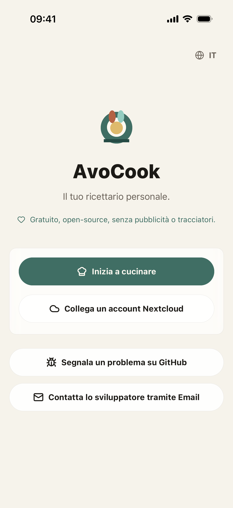

# AvoCook

AvoCook è un taccuino di ricette mobile — funziona completamente offline, sul tuo dispositivo, senza bisogno di un account. Se hai già un server Nextcloud, puoi collegarlo facoltativamente per tenere le ricette sincronizzate tra i dispositivi.

L'ho sviluppato per uso personale mentre imparavo a portare avanti un progetto React Native completo dall'inizio alla fine.

[App Store](https://apps.apple.com/app/avocook/id6769012665) · [Google Play](https://play.google.com/store/apps/details?id=app.avocook.mobile) · [APK Android](https://github.com/Logarex/AvoCook/releases/latest) · [](https://github.com/Logarex/AvoCook/releases)

<div align="center">
  
  
</div>

---

## Novità della v4.0.0

**Piattaforma di Ricette Comunitaria**
- **Condividi, Valuta e Importa:** Un nuovo grande spazio per scoprire, valutare, segnalare e importare ricette direttamente dalla comunità AvoCook.
- **Profili Comunitari:** Imposta uno pseudonimo comunitario per condividere i tuoi piatti migliori.
- **Metadati Ricchi:** Le ricette comunitarie supportano completamente informazioni nutrizionali e tempi di preparazione.
- **Moderazione e Qualità:** Un filtro globale per le volgarità mantiene la piattaforma sicura e un sistema di rilevamento dei duplicati previene lo spam.

**Liste della Spesa Condivise in Tempo Reale**
- **Collaborazione con Codice a 6 Cifre:** Ora puoi condividere e collaborare alle liste della spesa con un semplice codice.
- **Indicatore di Sincronizzazione:** Aggiunto un indicatore di stato della sincronizzazione visibile.

**Miglioramenti dell'Interfaccia (UI)**
- **Selezione Rapida Categorie:** Nuovo pulsante per il filtro categorie direttamente nella lista ricette.
- **Migliori Modali:** La modale di selezione ricette ora le ordina alfabeticamente.
- **Impostazioni e Tipografia:** Etichette multilinea nelle impostazioni e tipografia migliorata.
- **Normalizzazione dei Caratteri:** Ricerca e ordinamento ottimizzati per i caratteri speciali.

**Sotto il cofano e Lingue**
- **Lingua Danese:** Supporto completo per il danese! Le importazioni preservano meglio la lingua originale.
- **Motore di Traduzione:** Tutte le stringhe rimaste sono state migrate alle chiavi i18n per una traduzione assoluta.
- **Prestazioni:** Gestione degli stati asincroni fortemente ottimizzata per una maggiore reattività.

---

## Funzionalità

### Ricette

- Creare e modificare ricette localmente, senza account;
- Organizzare le ricette per categoria;
- Adattare le quantità al numero di porzioni;
- Aggiungere una o più foto a ogni ricetta;
- Esportare una ricetta in PDF o stamparla direttamente;
- Condividere una ricetta con un'altra app.

### Importazione

- Importare una ricetta da un URL — funziona su qualsiasi sito che esponga dati `schema.org/Recipe` (Marmiton, 750g, BBC Good Food e molti altri);
- Ricevere un URL condiviso da un browser o un'altra app per importare una ricetta con un tocco;
- Scansionare una ricetta da una foto, o generare una ricetta da una foto di un piatto con l'IA (richiede una chiave API compatibile con OpenAI).

### Lista della spesa

- Copiare gli ingredienti negli appunti con un tocco;
- Esportare una lista della spesa in Promemoria iOS per sfruttare la condivisione Apple e l'integrazione con Siri.

### Timer

- Avviare uno o più timer di cottura direttamente da una ricetta;
- I timer inviano una notifica locale anche quando l'app è in background.

### Dati e sincronizzazione

- Eseguire il backup di tutte le ricette in un file JSON e ripristinarle;
- **Facoltativo**: collegare un server Nextcloud Cookbook per sincronizzare le ricette tra i dispositivi. I dati passano direttamente tra l'app e il tuo server, senza intermediari.

> In modalità locale, tutto rimane sul dispositivo. Nessun account, nessun cloud, nessun tracciamento.

---

## Lingue disponibili

Francese · Inglese · Tedesco · Spagnolo · Italiano

---

## Configurazione per lo sviluppo

Il progetto utilizza Expo, React Native e TypeScript.

```bash
npm install
npm run ios      # Simulatore iOS
npm run android  # Emulatore Android
```

Al primo avvio viene compilata una build di sviluppo con i moduli nativi. Successivamente l'app si apre direttamente.

Comandi utili:

```bash
npm run typecheck                      # Verifiche TypeScript
npm test                               # Test unitari (Vitest)
npm run lint                           # ESLint
npm run import:check -- <url-ricetta>  # Testare l'importazione da un URL
```

---

## Struttura del progetto

```
src/
├── App.tsx                              # Punto di ingresso, navigazione
├── screens/                             # Schermate (lista, dettaglio, editor, impostazioni…)
├── components/                          # Componenti UI riutilizzabili
├── features/
│   ├── recipes/                         # Archiviazione locale (SQLite), logica ricette, backup
│   ├── nextcloud/                       # Client HTTP per Nextcloud Cookbook
│   ├── import/                          # Importazione da URL e foto
│   ├── shopping/                        # Lista della spesa e sync con Promemoria iOS
│   ├── timers/                          # Timer di cottura
│   ├── preferences/                     # Impostazioni dell'applicazione
│   └── auth/                            # Autenticazione Nextcloud
├── i18n/                                # Internazionalizzazione (i18next, 5 lingue)
├── modules/
│   └── avocook-timer-notifications/     # Modulo nativo per le notifiche dei timer
└── theme/                               # Colori, tipografia, stili condivisi
tools/                                   # Plugin di build, verifica import, asset
docs/                                    # Documentazione in altre lingue (fr, de, es, it)
```

---

## Nextcloud Cookbook

Per testare la sincronizzazione:

1. Installa l'[app Cookbook](https://apps.nextcloud.com/apps/cookbook) su un'istanza Nextcloud.
2. Crea una **password per l'app** nelle impostazioni di sicurezza (Impostazioni → Sicurezza → Dispositivi e sessioni).
3. In AvoCook (Impostazioni), inserisci l'URL del server, il nome utente e quella password.

L'app impone HTTPS per i server remoti. L'HTTP semplice è accettato solo per `localhost` durante lo sviluppo.

---

## Android

Gli APK sono pubblicati nelle [release GitHub](https://github.com/Logarex/AvoCook/releases). Scarica `avocook.apk` e installalo direttamente.

---

## Contribuire

Le pull request sono benvenute. Consulta [CONTRIBUTING.md](../../.github/CONTRIBUTING.md) per le linee guida e il modello di PR.

---

## Supporta il progetto ☕

Se AvoCook ti è utile, puoi contribuire a coprire le spese:

**[→ Dona tramite Revolut](https://revolut.me/logarex)** · **[→ Dona tramite PayPal](https://paypal.me/logarex31)**

---

## Licenza

Questo progetto è rilasciato sotto licenza [GPLv3](../../LICENSE).
